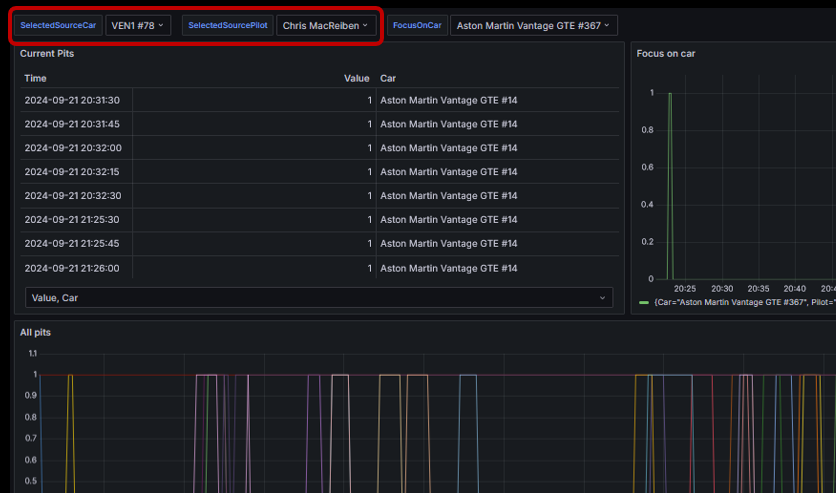
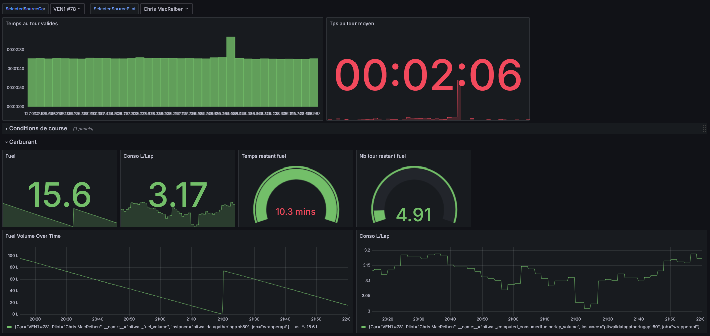
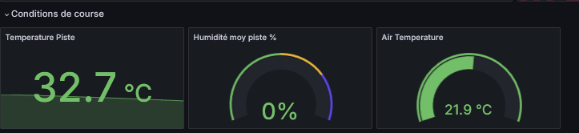
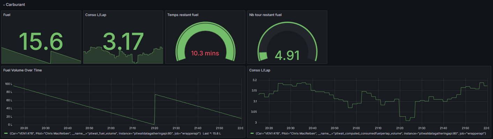
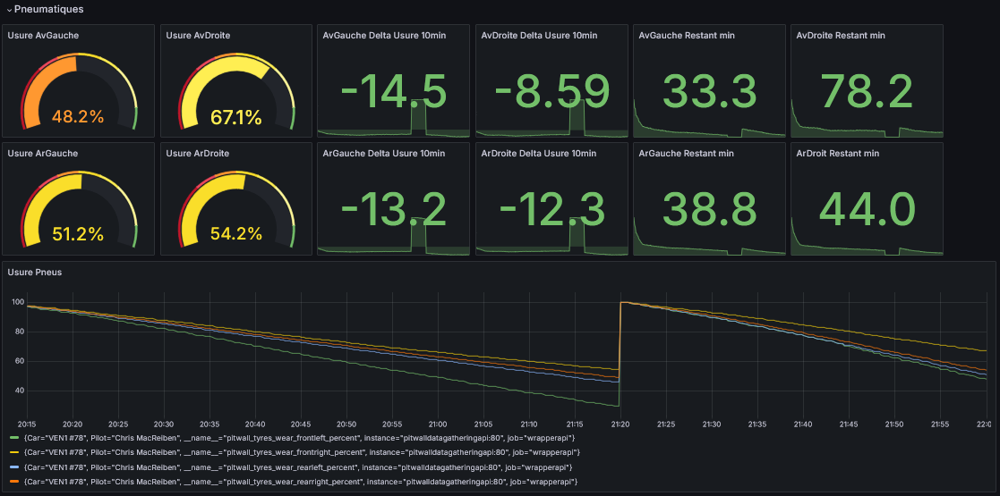
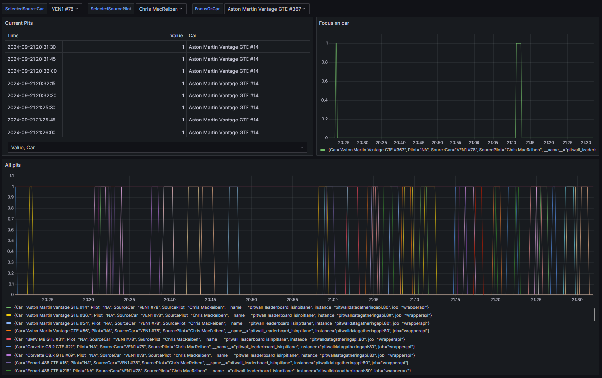
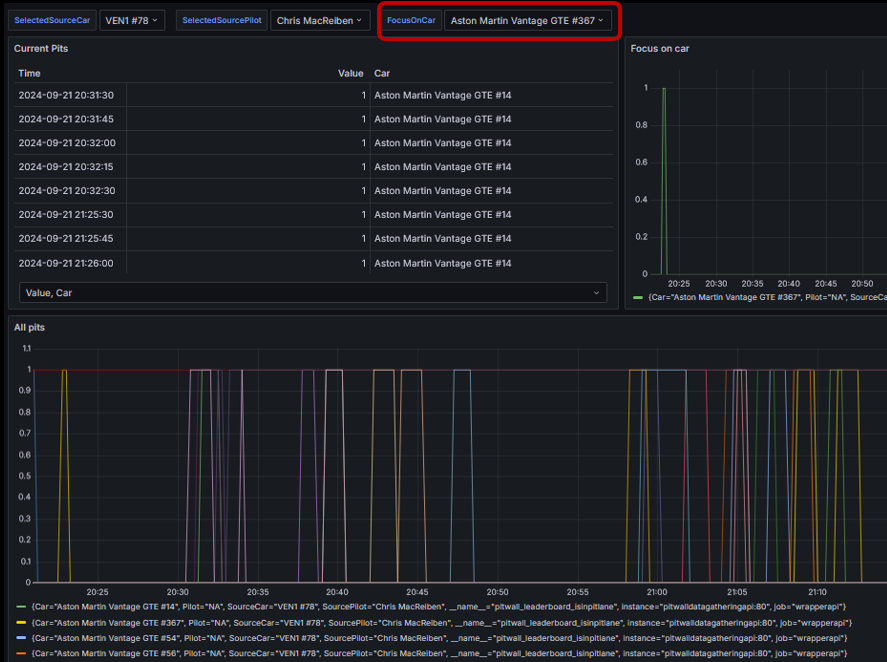

# pitwall-dashboard-grafana

On the shelf Grafana dashboards to use for virtual pitwall.

See those project to be able to use it: 
- [Pitwall Acquisition Plugin](https://github.com/macreiben-dev/pit-wall-acquisition) 
- [Pitwall API](https://github.com/macreiben-dev/pit-wall-api) 

Each dashboard requires you to select a car and a pilot in the top left comboboxes.

## Overview

### Consistency and fuel

### Race condition

### Fuel

### Tyres analysis

## Pits

Displays an overview of who is in the pitlane. 1 means that the car is in the pitlane, 0 out. 

Select the source car and pilot at the top left of the screen to feed the dashboard.

### Display pits information for one car

The focus on car allows you to select one car to feed the top right graph.

To do, on the top of th dashboard fill the *FocusOnCar* combobox.

