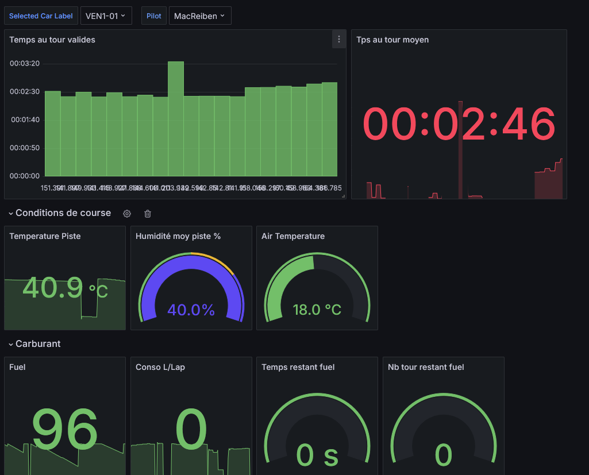
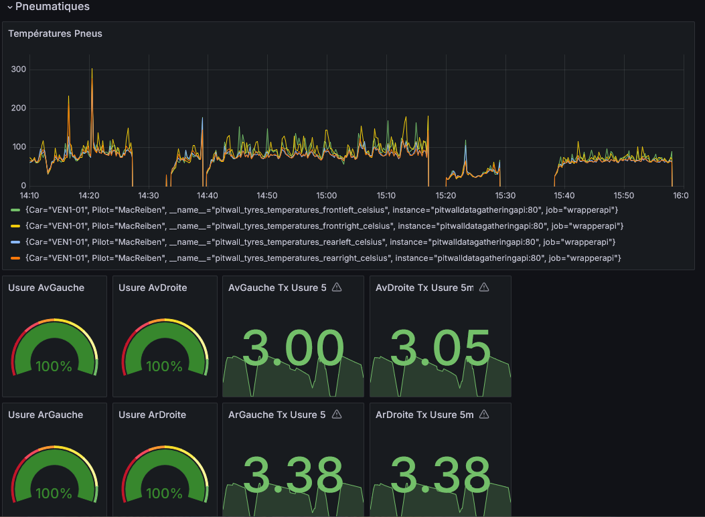

# pitwall-dashboard-grafana

On the shelf Grafana dashboards to use for virtual pitwall.

See those project to be able to use it: 
- [Pitwall Acquisition Plugin](https://github.com/macreiben-dev/pit-wall-acquisition) 
- [Pitwall API](https://github.com/macreiben-dev/pit-wall-api) 

## Overview

